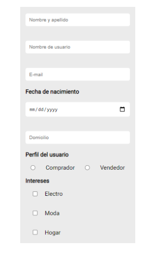
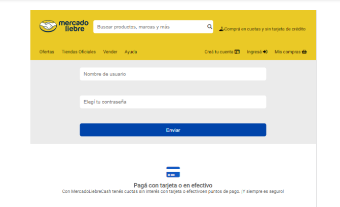

# Trabajo Practico Numero 5 - Mercado Liebre - Formularios.

## Desafio 1: 
### Al seleccionar "Crea tu cuenta" Este deberá contar con la siguiente información:
#### Registro de Usuario (register.html ):
- Nombre y apellido.
- Nombre de usuari@.
- Fecha de nacimiento.
- Domicilio.
- Perfil del usuario (consultar a l@s usuari@s si quieren comprar o vender).
- Categorías de interés (puede elegir más de una):
     - Electro
     - Moda
     - Hogar
     - Juguetería
     -Vida sana
- Foto de usuario.
- Contraseña.
- Confirmar contraseña.
- Botón de enviar que nos lleve a la página principal.
- Botón de borrar todos los datos del formulario.

## Desafio 2:
### Al seleccionar "Ingresa" Este deberá contar con la siguiente información:
#### Login de Usuario (login.html ):
- Nombre de usuari@.
- Contraseña.
- Botón de enviar que nos lleve a la página principal.

## Desafio 3:
### Es necesario indicarle al usuario, con un mensaje de error, cuando un dato solicitado no cumple con el formato permitido. Por ejemplo, si el usuario ingresa un nombre con un solo carácter deberíamos indicar el error.

## Desafio 4: 
### Cuando agregamos un formulario a nuestro sitio es necesario hacer un análisis previo sobre qué datos y qué tipos de datos vamos a solicitar. Luego, con ayuda de conceptos de UX, debemos analizar cómo vamos a presentarles el formulario a los usuarios. Nuestro desafío ahora es darle un buen diseño tanto al formulario de registro como al formulario de login.

## Desafio 5:
### Transformar el search bar a un formulario.

## Resultados esperados:

***************************************************************************************************************

****************************************************************************************************************
